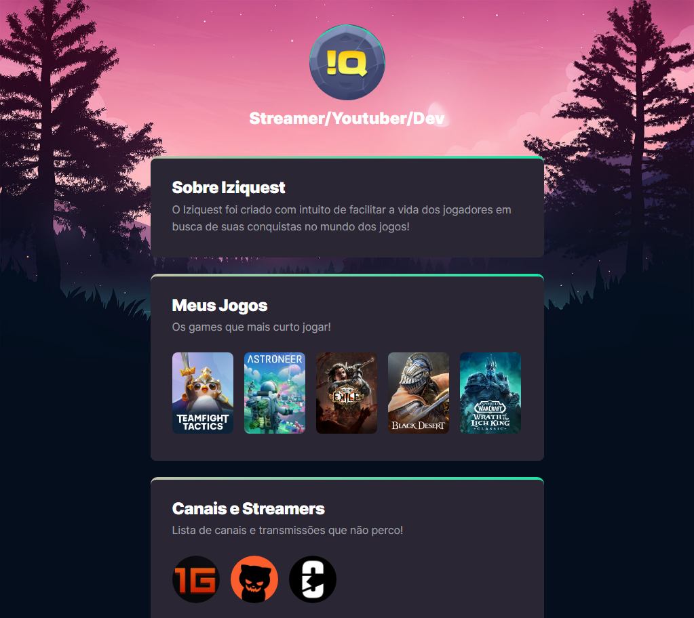

# NLW eSPORTS

> Trilha Explorer

Projeto desenvolvido no evento Next Level Week da Rocketseat.

[Clique aqui para acessar](https://silvinsouza.github.io/nlw-esports-explorer)

## 🛠 Tecnologias

- HTML
- CSS
- Git E Github

### O que aprendi?

> HTML

- O que é o HTML
- Hypertext
- Markup
- Sintaxe de uma tag
- Atributos
- Comentários

> CSS

- O que é CSS
- Declaration
- Comentários
- Cascading
- Specificity
- Box Model

> GitHub

- O que é GitHub
- Criação de repositorio com upload de arquivos 
- Criação de página do repositório
- Alterações nos arquivos diretamente no repositório 
- Criação de documentação

#### ✉ Contato

- silvio.oliveira.souza@outlook.com
